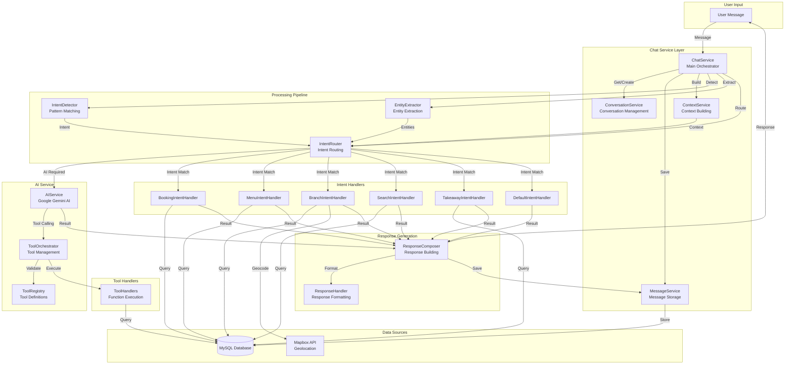
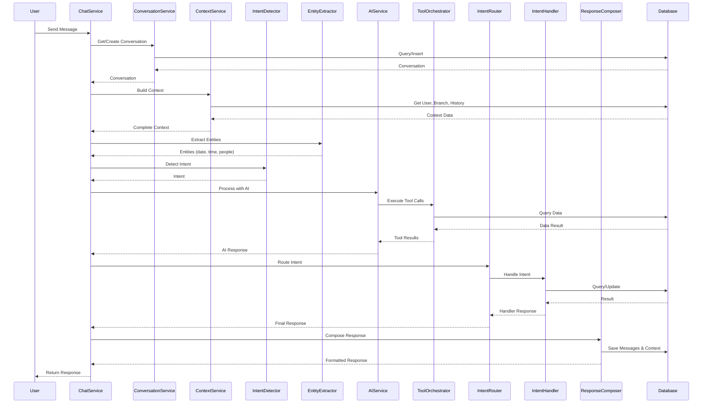

# AI Chatbot System Architecture

## Chatbot Architecture Diagram

## Chatbot Processing Flow

## Components Description

### Core Services
- **ChatService**: Main orchestrator, coordinates all chatbot operations
- **ConversationService**: Manages conversation sessions and context
- **MessageService**: Handles message storage and retrieval
- **ContextService**: Builds conversation context from history and user data

### Processing Components
- **IntentDetector**: Pattern-based intent detection using regex and keyword matching
- **EntityExtractor**: Extracts entities (date, time, people, branch, etc.) from natural language
- **IntentRouter**: Routes detected intents to appropriate handlers

### AI Integration
- **AIService**: Google Gemini AI integration with Tool Calling pattern
- **ToolOrchestrator**: Manages tool execution, validation, and rate limiting
- **ToolRegistry**: Defines available tools and their permissions

### Intent Handlers
- **BookingIntentHandler**: Handles table reservation requests
- **MenuIntentHandler**: Handles menu viewing requests
- **BranchIntentHandler**: Handles branch information and nearest branch queries
- **SearchIntentHandler**: Handles product search requests
- **TakeawayIntentHandler**: Handles takeaway and delivery order requests
- **DefaultIntentHandler**: Handles general inquiries and fallback

### Response Generation
- **ResponseComposer**: Builds and formats bot responses
- **ResponseHandler**: Generates suggestions and action buttons

## Supported Intents

1. **greeting** - Welcome message
2. **book_table** - Table reservation
3. **view_menu** - View restaurant menu
4. **view_branches** - List all branches
5. **ask_branch** - Branch information inquiry
6. **find_nearest_branch** - Find nearest branch by location
7. **order_delivery** - Place delivery order
8. **order_takeaway** - Place takeaway order
9. **search_food** - Search for products
10. **view_orders** - View order history
11. **ask_info** - General information request

## Available Tools (Tool Calling)

1. **get_branch_menu** - Get menu for specific branch
2. **search_products** - Search products by keyword
3. **check_table_availability** - Check table availability
4. **create_reservation** - Create new reservation
5. **get_my_reservations** - Get user's reservations
6. **get_my_orders** - Get user's orders
7. **get_all_branches** - Get all branches
8. **get_branch_details** - Get branch details
9. **get_product_details** - Get product details
10. **get_categories** - Get product categories
11. **check_branch_operating_hours** - Check operating hours
12. **get_revenue_report** - Revenue report (Admin/Manager only)
13. **get_all_users** - Get all users (Admin only)
14. **get_all_reservations** - Get all reservations (Manager/Admin only)

## Key Features

- **Natural Language Processing**: Intent detection and entity extraction
- **Context-Aware Conversations**: Maintains conversation context across turns
- **Tool Calling Pattern**: AI can execute functions to get real-time data
- **Multi-turn Dialogue**: Supports complex multi-step conversations
- **Role-Based Access**: Different tools available based on user role
- **Rate Limiting**: Prevents abuse with role-based rate limits
- **Fallback Handling**: Graceful degradation when AI is unavailable

